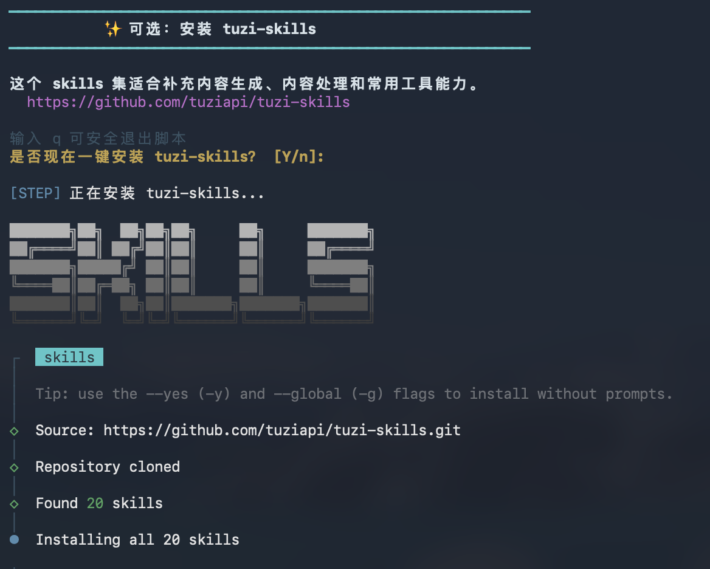
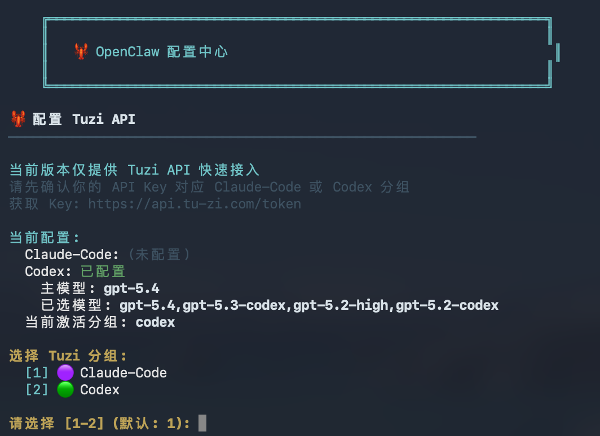

# 🦞 OpenClaw 一键部署工具

<p align="center">
  
  
  
</p>

> 🚀 一键部署你的私人 AI 助手 OpenClaw，内置 [Tuzi API](https://api.tu-zi.com/) 快速接入


<p align="center">
  
</p>

## 📖 目录

- [系统要求](#-系统要求)
- [快速开始](#-快速开始)
- [功能特性](#-功能特性)
- [详细配置](#-详细配置)
- [常用命令](#-常用命令)
- [配置说明](#-配置说明)
- [安全建议](#-安全建议)
- [常见问题](#-常见问题)
- [更新日志](#-更新日志)

## 💻 系统要求

| 项目 | 要求 |
|------|------|
| 操作系统 | Windows 11（x64/ARM64，PowerShell 5.1+ 或 WSL2）/ macOS 12+（Intel/Apple Silicon）/ Ubuntu 20.04+ / Debian 11+ / CentOS 8+ |
| CPU 架构 | 原生安装支持 x86_64/amd64、arm64/aarch64；Docker 使用对应的 multi-arch Node 基础镜像 |
| Node.js | Windows 由 OpenClaw 官方安装器检测并安装受支持版本；macOS/Linux 新安装固定 Node.js 22 LTS（最低 22.22.3）；Docker 随固定 OpenClaw 版本使用 Node.js 22 |
| 内存 | 最低 2GB，推荐 4GB+ |
| 磁盘空间 | 最低 1GB |

## 🚀 快速开始

### 方式一：一键安装（命令行版）

```bash
curl -fsSL https://raw.githubusercontent.com/Jerry-George-Liang/openclaw-shell/main/install.sh | bash
```

脚本会自动检测当前环境：
1. 如果未检测到可用的 OpenClaw 安装，则执行完整安装流程
2. 如果已检测到本机已有 OpenClaw，则让用户选择：
   - 继续完整安装/升级流程
   - 只修改配置，接入或更新 Tuzi API

安装脚本会自动：
1. 检测系统环境并安装依赖
2. 安装 OpenClaw
3. 引导完成核心配置（Tuzi API、身份信息）
4. 测试 API 连接
5. **自动启动 OpenClaw 服务**
6. 可选打开配置菜单进行详细配置（渠道等）

> Windows 原生环境请在 PowerShell 运行本项目入口：`$u='https://raw.githubusercontent.com/Jerry-George-Liang/openclaw-shell/main/install-windows.ps1?cachebust='+[guid]::NewGuid().ToString('N'); irm $u | iex`。动态参数用于避免 GitHub CDN 或本地缓存返回旧脚本。它会设置 UTF-8、调用官方安装器并直接进入本项目的 Tuzi 配置，不再进入 OpenAI onboarding。不要在 `cmd.exe` 或 Git Bash 中运行 `install.sh`；如需 Bash 配置菜单，请使用 WSL2。

#### Windows 原生安装

在 Windows PowerShell 5.1+ 或 PowerShell 7 中执行：

```powershell
$u='https://raw.githubusercontent.com/Jerry-George-Liang/openclaw-shell/main/install-windows.ps1?cachebust='+[guid]::NewGuid().ToString('N'); irm $u | iex
```

从仓库运行前可先做 Win11 环境预检；它只检查 Windows 版本、CPU 架构和 PowerShell 版本，不安装软件、不修改 OpenClaw 配置。脚本文件带 UTF-8 BOM，可直接在 Windows PowerShell 5.1 本地执行，避免中文提示按系统 ANSI 解码：

```powershell
powershell.exe -NoProfile -ExecutionPolicy Bypass -File .\install-windows.ps1 -CheckOnly
```

脚本会明确显示 Windows 11 build 与 x64/ARM64 架构。低于 Windows 11 build 22000 时仅以兼容模式继续，不作为已验证环境。

| 能力 | Win11 原生 PowerShell | Win11 + WSL2 |
|------|-----------------------|--------------|
| OpenClaw 安装/升级 | ✅ | ✅ |
| Tuzi/GAC 模型配置与连接测试 | ✅ | ✅ |
| Gateway 后台服务 | ✅（Windows 计划任务） | ✅（需启用 systemd） |
| 完整交互式渠道配置菜单 | 使用官方渠道命令 | ✅ |
| Docker Desktop 部署 | ✅ | ✅ |

如果当前已经打开的是 `cmd.exe`，直接执行下面两行即可，脚本会自动切换到 PowerShell：

```bat
curl.exe -fsSL https://raw.githubusercontent.com/Jerry-George-Liang/openclaw-shell/main/install-windows.cmd -o install-windows.cmd
install-windows.cmd
```

CMD 启动器每次都会使用随机参数下载最新 PowerShell 脚本。不要在 `cmd.exe` 中执行 `curl ... | bash`；`cmd.exe` 不支持 Bash，也无法正确处理该交互输入。脚本启动后应显示 `Installer version`；如果没有显示，说明运行的仍是之前保存的旧文件，请重新下载 CMD 启动器。

已经安装 OpenClaw、只需要重新配置 Tuzi 时，先下载再带参数运行：

```powershell
irm https://raw.githubusercontent.com/Jerry-George-Liang/openclaw-shell/main/install-windows.ps1 -OutFile .\install-windows.ps1
& .\install-windows.ps1 -SkipOfficialInstall
```

Windows 原生流程与 macOS/Linux 的核心结果保持一致：

1. 选择 `Claude-Code`、`Codex` 或 `GACCode`
2. 隐藏输入 API Key；Claude-Code/Codex 会实时拉取可见模型并支持多选
3. 写入 `~/.openclaw/openclaw.json`；修改已有配置前自动生成带时间戳的备份
4. GACCode 同时配置 `gac-claude` 和 `gac-codex`
5. 可选执行隔离的 `openclaw agent exec` 测试，不写入 `session main`
6. 可选安装 Gateway 系统服务并立即启动

当前终端能找到 `openclaw` 时，脚本会在写入后执行官方配置校验；若校验失败则自动恢复原配置，避免 CLI 版本变化留下不可用配置。

如果 Windows PowerShell 获取模型列表时出现 TLS/连接关闭错误，脚本会自动改用已安装的 Node.js 兼容通道重试；两条通道都不可用时才提示手动输入模型名称。

Windows 下启动：`openclaw gateway start`；打开持续会话界面：`openclaw tui`。Windows 原生脚本暂不包含 Bash 的完整渠道配置菜单；如需该菜单请使用 WSL2，或安装后使用 OpenClaw 官方渠道命令配置。

在 WSL2 中使用 Bash 安装器前，先确认 `ps -p 1 -o comm=` 输出 `systemd`。若不是，请在 `/etc/wsl.conf` 启用 systemd 后从 Windows 执行 `wsl --shutdown`；否则 Gateway 系统服务无法开机启动，可暂时使用 `openclaw gateway run` 前台运行。

如果升级已有安装时出现 `SERVICE_DEFINITION_UNKNOWN`，或提示 `Gateway service ownership or shutdown could not be verified`，表示官方安装器无法安全确认旧 Gateway 服务由谁创建。新版包装脚本会在确认 `openclaw` 命令可用后继续完成 Tuzi 配置，但不会强制覆盖、停止或重启归属不明的服务。请先运行：

```powershell
openclaw gateway status --deep
```

根据输出停止对应服务，再执行 `openclaw doctor --fix`；修复后运行 `openclaw gateway install` 和 `openclaw gateway start`。如果安装刚完成而当前终端还没有刷新 npm 命令路径，脚本仍会完成 Tuzi 配置，只跳过 CLI 测试和 Gateway 操作；重新打开 PowerShell 后再运行这些命令即可。

在服务归属处理完成前，不要重复运行 `openclaw gateway start`。如需先临时使用，可在一个 PowerShell 窗口运行 `openclaw gateway run` 并保持窗口打开，再在另一个窗口运行 `openclaw tui`。

新版 Windows 脚本遇到 `agent.legacy-*` 状态迁移备份时，会在独立的 Windows PowerShell 进程中自动再次运行一次 `openclaw doctor --fix`；修复成功后通过官方 `openclaw gateway install --force` 重建当前账号的计划任务。旧目录始终保留，不会被脚本删除。若独立进程仍无法确认服务归属，请关闭其他 OpenClaw/TUI/Gateway 窗口后，在新的 PowerShell 中重试 Doctor。

### 方式二：手动安装

```bash
# 1. 克隆仓库
git clone https://github.com/Jerry-George-Liang/openclaw-shell.git
cd openclaw-shell

# 2. 添加执行权限
chmod +x install.sh config-menu.sh

# 3. 运行安装脚本
./install.sh

# 如果全局安装遇到权限问题，可安装到用户目录
npm install -g openclaw --prefix ~/.local
export PATH="$HOME/.local/bin:$PATH"
```

### 已安装 OpenClaw 的用户

如果你已经装好了 OpenClaw，只想把 Tuzi API 配进去，仍然使用同一条命令即可：

```bash
curl -fsSL https://raw.githubusercontent.com/Jerry-George-Liang/openclaw-shell/main/install.sh | bash
```

脚本检测到已有安装后，会自动跳过：
1. 依赖安装
2. OpenClaw 安装或升级
3. 身份信息配置
4. 开机自启动配置

检测到已有 OpenClaw 时，脚本会先让你选择：
1. 继续完整安装/升级流程
2. 只修改配置，接入或更新 Tuzi API

并只执行：
1. 检查现有 `openclaw` 命令
2. 引导填写 Tuzi API Key 和模型
3. 写入 `~/.openclaw/env` 与 `~/.openclaw/openclaw.json`
4. 测试 API 连接
5. 可选启动或重启 OpenClaw 服务

如果你需要强制指定模式，也可以本地执行：

```bash
./install.sh --full-install
./install.sh --tuzi-only
```

### 安装完成后

安装完成后脚本会：
1. **自动询问是否启动服务**（推荐选择 Y）
2. 后台启动 OpenClaw Gateway
3. 可选打开配置菜单进行渠道配置

如果需要后续管理：

```bash
# 手动启动服务
source ~/.openclaw/env && openclaw gateway run

# 后台启动服务
openclaw gateway start

# 运行配置菜单进行详细配置
bash ~/.openclaw/config-menu.sh

# 如果本地没有配置菜单，可下载到固定位置后运行
curl -fsSL https://raw.githubusercontent.com/Jerry-George-Liang/openclaw-shell/main/config-menu.sh -o ~/.openclaw/config-menu.sh && bash ~/.openclaw/config-menu.sh
```

#### 可选：安装 `tuzi-skills`

在 Tuzi API 配置完成后，安装器会介绍并询问你是否一键安装 [`tuziapi/tuzi-skills`](https://github.com/tuziapi/tuzi-skills)。这是一个基于兔子 API 的 skills 集，支持 Claude Code 和 OpenClaw，适合补充内容生成、AI 生成后端和常用工具能力。

<p align="center">
  
</p>

仓库地址：
[https://github.com/tuziapi/tuzi-skills](https://github.com/tuziapi/tuzi-skills)

```bash
# 一键安装命令
npx skills add tuziapi/tuzi-skills --agent openclaw --yes
```

安装后可以直接告诉 Agent：`请帮我用 tuzi-skills 生成内容或图片`。详情请查看：[tuziapi/tuzi-skills](https://github.com/tuziapi/tuzi-skills)。

## ✨ 功能特性

### 🤖 Tuzi API 快速接入

<p align="center">
  
</p>

- 安装器和配置菜单都默认进入 **Tuzi API** 配置流程
- 支持用户在配置时选择 **Claude-Code** 或 **Codex**
- 每个分组使用各自独立的 **API Key**，不会混用
- 模型通过预置列表选择，并保留“自定义模型名称”选项
- 可重复添加 `Claude-Code` 和 `Codex`，配置会并存为两个 Provider
- 配置会自动写入 `~/.openclaw/openclaw.json` 的 `auth`、`models`、`agents` 段落

### 📱 多渠道接入

<p align="center">
  
</p>

- Telegram Bot
- Discord Bot
- WhatsApp
- Slack
- 微信 (WeChat)
- iMessage (仅 macOS)
- 飞书 (Feishu)

### 🧪 快速测试

<p align="center">
  
</p>

- API 连接测试
- 渠道连接验证
- OpenClaw 诊断工具

### 🧠 核心能力
- **持久记忆** - 跨对话、跨平台的长期记忆
- **主动推送** - 定时提醒、晨报、告警通知
- **技能系统** - 通过 Markdown 文件定义自定义能力
- **远程控制** - 可执行系统命令、读写文件、浏览网络

## ⚙️ 详细配置

### 配置 AI 模型

运行配置菜单后选择 `[2] AI 模型配置`，将直接进入 Tuzi API 配置流程：

<p align="center">
  
</p>

1. 选择 Tuzi API 分组：`Claude-Code` 或 `Codex`
2. 输入该分组专用的 API Key
3. 从预置模型列表中连续选择一个或多个模型
4. 第一个模型会作为默认模型，其余模型会自动写入 fallback 列表，也支持自定义模型名称
5. 如有需要，可再次进入配置流程添加另一个分组，两个分组会作为独立 Provider 一起写入 `~/.openclaw/openclaw.json`
6. 首次配置会自动设置默认模型；后续新增另一个分组时会保留当前默认模型不变，除非你重新配置当前默认分组

> 💡 API Key 获取地址: [https://api.tu-zi.com/token](https://api.tu-zi.com/token)
>
> 💡 API Key 获取教程: [Bilibili 视频教程](https://www.bilibili.com/video/BV1k4PqzPEKz/?vd_source=1bbfadebd95fffa76963a8b99d5d96b9)
>
> ⚠️ `Claude-Code` 和 `Codex` 必须使用各自分组对应的 Key，不能混用

#### Claude-Code 可选模型

`claude-sonnet-4-6`、`claude-sonnet-4-6-thinking`、`claude-sonnet-4-5-20250929-thinking`、`claude-sonnet-4-5-20250929`、`claude-sonnet-4-20250514-thinking`、`claude-sonnet-4-20250514`、`claude-opus-4-6`、`claude-opus-4-5-20251101-thinking`、`claude-opus-4-5-20251101`、`claude-opus-4-5`、`claude-opus-4-20250514-thinking`、`claude-opus-4-20250514`

#### Codex 可选模型

`gpt-5.4`、`gpt-5.3-codex`、`gpt-5.2-medium`、`gpt-5.2-high`、`gpt-5.2-codex`、`gpt-5.2`、`gpt-5.1-high`、`gpt-5.1-medium`、`gpt-5.1-low`、`gpt-5.1-codex-max-high`、`gpt-5.1-codex-max`、`gpt-5.1`、`gpt-5-codex`、`gpt-5-high`、`gpt-5-low`、`gpt-5`

### 配置 Telegram 机器人

1. 在 Telegram 中搜索 `@BotFather`
2. 发送 `/newbot` 创建新机器人
3. 设置机器人名称和用户名
4. 复制获得的 **Bot Token**
5. 搜索 `@userinfobot` 获取你的 **User ID**
6. 在配置菜单中选择 Telegram，输入以上信息

### 配置 Discord 机器人

**第一步：创建 Discord 应用和机器人**

1. 访问 [Discord Developer Portal](https://discord.com/developers/applications)
2. 点击 "New Application" 创建新应用
3. 进入应用后，点击左侧 "Bot" 菜单
4. 点击 "Reset Token" 生成并复制 **Bot Token**
5. ⚠️ **开启 "Message Content Intent"**（重要！否则无法读取消息内容）

**第二步：邀请机器人到服务器**

1. 点击左侧 "OAuth2" → "URL Generator"
2. Scopes 勾选：`bot`
3. Bot Permissions 至少勾选：
   - View Channels（查看频道）
   - Send Messages（发送消息）
   - Read Message History（读取消息历史）
4. 复制生成的 URL，在浏览器打开并选择服务器
5. 确保机器人在目标频道有权限

**第三步：获取频道 ID**

1. 打开 Discord 客户端，进入 "用户设置" → "高级"
2. 开启 "开发者模式"
3. 右键点击你想让机器人响应的频道
4. 点击 "复制频道 ID"

**第四步：在配置菜单中配置**

在配置菜单中选择 Discord，输入 Bot Token 和 Channel ID

### 配置飞书机器人

> 📖 **详细文档**: 查看 [飞书机器人配置指南](docs/feishu-setup.md) 获取完整的配置说明和常见问题解答。

> 💡 **无需公网服务器**：OpenClaw 使用飞书的 WebSocket 长连接模式接收事件，无需配置 Webhook 地址。

1. 访问 [飞书开放平台](https://open.feishu.cn/)
2. 创建企业自建应用（个人账号即可，无需企业认证）
3. **添加机器人能力**：
   - 进入路径：开发者后台 → 应用详情 → 添加应用能力
   - 确认：确保"机器人"开关是打开状态
4. 获取 **App ID** 和 **App Secret**
5. 在"权限管理"中添加权限：
   - `im:message` (收发消息)
   - `im:message:send_as_bot` (发送消息)
   - `im:chat:readonly` (读取会话信息)
6. 发布应用：版本管理与发布 → 创建版本 → 发布
7. **在配置菜单中配置飞书**：启动官方登录向导完成授权，再启动 OpenClaw 服务
8. 配置"事件订阅"（使用长连接）：
   - 进入：事件与回调 → 选择「**使用长连接接收事件**」
   - 添加事件：`im.message.receive_v1`（接收消息）
   - **无需填写 Webhook 地址**
   - ⚠️ **注意**：需要 OpenClaw 服务已启动，才能保存长连接设置
9. 添加机器人到群组：群设置 → 群机器人 → 添加机器人

### 配置 WhatsApp

> 💡 **无需 Business API**：OpenClaw 通过扫码登录你的 WhatsApp 账号，无需申请 Business API。

1. 在配置菜单中选择 `[3] 消息渠道配置` → `[3] WhatsApp`
2. 系统会自动启用 WhatsApp 插件
3. 扫描终端显示的二维码完成登录
4. 登录成功后重启 Gateway 使配置生效
5. **测试**：用自己的 WhatsApp 给自己发消息即可触发机器人回复

> ⚠️ **注意**：WhatsApp 账号只能在一个设备上登录 Web 版，配置后原有的 WhatsApp Web 会被踢下线。

## 📝 常用命令

### 服务管理

```bash
# 启动服务（后台守护进程）
openclaw gateway start

# 停止服务
openclaw gateway stop

# 重启服务
openclaw gateway restart

# 查看服务状态
openclaw gateway status

# 前台运行（用于调试）
openclaw gateway run

# 查看日志
openclaw logs

# 实时日志
openclaw logs --follow
```

> 说明：`openclaw tui` 默认显示 `session main`，这是持续对话会话，会保留上下文。安装脚本和配置菜单的 AI 连通性测试使用隔离的 `openclaw agent exec`，只验证单次响应，不会写入 `session main`。

### 配置管理

```bash
# 打开配置文件
openclaw config

# 运行配置向导
openclaw onboard

# 诊断配置问题
openclaw doctor

# 健康检查
openclaw health
```

### 数据管理

```bash
# 导出对话历史
openclaw export --format json

# 清理记忆
openclaw memory clear

# 备份数据
openclaw backup
```

## 📋 配置说明

OpenClaw 使用以下配置方式：

- **环境变量**: `~/.openclaw/env` - 存储 API Key 和 Base URL
- **OpenClaw 配置**: `~/.openclaw/openclaw.json` - OpenClaw 内部配置（自动管理）
- **命令行工具**: `openclaw config set` / `openclaw models set` 等

> 💡 **注意**：配置主要通过安装向导或 `~/.openclaw/config-menu.sh` 完成，无需手动编辑配置文件

### 环境变量配置示例

`~/.openclaw/env` 文件内容：

```bash
# OpenClaw 环境变量配置
export ANTHROPIC_API_KEY=sk-ant-xxxxx
export ANTHROPIC_BASE_URL=https://your-api-proxy.com  # 可选，自定义 API 地址

# 或者 OpenAI
export OPENAI_API_KEY=sk-xxxxx
export OPENAI_BASE_URL=https://your-api-proxy.com/v1  # 可选
```

### 自定义 Provider 配置

当使用自定义 API 地址时，安装脚本会自动在 `~/.openclaw/openclaw.json` 中配置自定义 Provider：

```json
{
  "models": {
    "providers": {
      "anthropic-custom": {
        "baseUrl": "https://your-api-proxy.com",
        "apiKey": "your-api-key",
        "models": [
          {
            "id": "claude-sonnet-4-5-20250929",
            "name": "claude-sonnet-4-5-20250929",
            "api": "anthropic-messages",
            "input": ["text"],
            "contextWindow": 200000,
            "maxTokens": 8192
          }
        ]
      }
    }
  }
}
```

### 目录结构

```
~/.openclaw/
├── openclaw.json        # OpenClaw 核心配置
├── env                  # 环境变量 (API Key 等)
├── backups/             # 配置备份
└── logs/                # 日志文件 (由 OpenClaw 管理)
```

## 🛡️ 安全建议

> ⚠️ **重要警告**：OpenClaw 需要完全的计算机权限，请务必注意安全！

### 部署建议

1. **不要在主工作电脑上部署** - 建议使用专用服务器或虚拟机
2. **使用 AWS/GCP/Azure 免费实例** - 隔离环境更安全
3. **Docker 部署** - 提供额外的隔离层；默认只映射到 `127.0.0.1`，并且必须设置 Gateway Token

```bash
export OPENCLAW_GATEWAY_TOKEN="$(openssl rand -hex 32)"
docker compose up -d --build
```

Windows PowerShell 使用：

```powershell
$env:OPENCLAW_GATEWAY_TOKEN = [Guid]::NewGuid().ToString('N') + [Guid]::NewGuid().ToString('N')
docker compose up -d --build
```

如需让局域网设备访问，需明确修改 `docker-compose.yml` 的端口映射；不得移除 Gateway Token。

> Linux 使用绑定目录时，容器以非 root 的 `node` 用户（UID 1000）运行。首次启动前请执行 `mkdir -p ~/.openclaw`；若宿主用户不是 UID 1000，请执行 `sudo chown -R 1000:1000 ~/.openclaw`，或将 Compose 的绑定目录改为 Docker named volume。macOS/Windows Docker Desktop 通常由文件共享层处理权限，但仍需在 Docker Desktop 中允许工作目录访问。仓库已强制所有容器 Shell 脚本使用 LF，避免 Windows Git 的 CRLF 转换破坏容器入口。

### 权限控制

1. **禁用危险功能**（默认已禁用）
   ```yaml
   security:
     enable_shell_commands: false
     enable_file_access: false
   ```

2. **启用沙箱模式**
   ```yaml
   security:
     sandbox_mode: true
   ```

3. **限制允许的用户**
   ```yaml
   channels:
     telegram:
       allowed_users:
         - "only-your-user-id"
   ```

### API Key 安全

- 定期轮换 API Key
- 不要在公开仓库中提交配置文件
- 使用环境变量存储敏感信息

```bash
# 使用环境变量
export ANTHROPIC_API_KEY="sk-ant-xxx"
export TELEGRAM_BOT_TOKEN="xxx"
```

## ❓ 常见问题

### Q: 安装时提示 Node.js 版本过低？

```bash
# macOS
brew install node@22
brew unlink node
brew link --overwrite --force node@22

# Ubuntu/Debian（Node 22 LTS）
curl -fsSL https://deb.nodesource.com/setup_22.x | sudo -E bash -
sudo apt-get install -y nodejs
```

Windows 请使用 PowerShell 官方安装器或 WSL2，不要在 Git Bash/Cygwin 中尝试执行本脚本。

如果 Linux 日志显示 Node.js 22 已由 `apt`/`dnf` 安装，但随后仍检测到 Node.js 18，说明旧的 nvm/asdf 路径覆盖了 `/usr/bin/node`。安装器会自动验证并切换到系统安装的受支持 Node.js，同时把正确路径写入当前用户的 shell 配置。

### Q: 其他依赖是否需要手动固定版本？

新安装只固定 Node.js 22 LTS；`curl`、`wget`、`jq`、`git`、`openssl` 和 Docker 基础工具使用系统稳定仓库或 Docker 官方 multi-arch 镜像。它们在不同发行版的可用版本不同，强行固定具体小版本反而容易导致旧系统无法解析或下载。Docker 默认使用 `node:22-bookworm-slim`，也可通过 `NODE_VERSION` 明确覆盖。

### Q: npm 报 `EACCES` 或提示 `.npm` 目录由 root 拥有？

安装器会自动检测并修复当前用户的 `~/.npm` 缓存权限；如果系统不允许修改，则自动切换到当前用户可写的临时缓存后继续安装。不要把整个系统目录递归改成普通用户权限。

### Q: 启动后无法连接？

1. 检查配置文件是否正确
2. 运行诊断命令：`openclaw doctor`
3. 查看日志：`openclaw logs`

### Q: Telegram 机器人没有响应？

1. 确认 Bot Token 正确
2. 确认 User ID 在 allowed_users 列表中
3. 检查网络连接（可能需要代理）

### Q: 如何更新到最新版本？

```bash
# 使用官方更新流程
openclaw update

# 或使用配置菜单
bash ~/.openclaw/config-menu.sh
# 选择 [8] 高级设置 → [6] 更新 OpenClaw
```

如果菜单提示“安装来源无法识别”，说明 OpenClaw 是通过无法追踪的 npm 回退路径安装的。请先重新运行官方安装器建立包管理器关联，再执行更新；不要手动更新 npm 全局包来绕过官方更新流程：

```bash
curl -fsSL https://openclaw.ai/install.sh | bash -s -- --install-method npm --no-prompt --no-onboard --verify
```

### Q: 如何备份数据？

```bash
# 手动备份
cp -r ~/.openclaw ~/openclaw_backup_$(date +%Y%m%d)

# 使用命令备份
openclaw backup
```

### Q: 如何完全卸载？

```bash
# 停止服务
openclaw gateway stop

# 卸载程序
npm uninstall -g openclaw

# 删除配置（可选）
rm -rf ~/.openclaw
```

## 📜 更新日志

### v1.0.0 (2026-01-29)
- 🎉 首次发布
- ✨ 支持一键安装部署
- ✨ 交互式配置菜单
- ✨ 多模型支持 (Claude/GPT/Ollama)
- ✨ 多渠道支持 (Telegram/Discord/WhatsApp)
- ✨ 技能系统
- ✨ 安全配置

## 📄 许可证

本项目基于 MIT 许可证开源。

## 🔗 相关链接

- [OpenClaw 官网](https://openclaw.ai)
- [官方文档](https://docs.openclaw.ai)
- [🖥️ OpenClaw Manager 桌面版](https://github.com/cwj526/openclaw-manager) - 图形界面管理工具
- [安装工具仓库](https://github.com/Jerry-George-Liang/openclaw-shell) - 命令行版本
- [OpenClaw 主仓库](https://github.com/openclaw/openclaw)
- [社区讨论](https://github.com/Jerry-George-Liang/openclaw-shell/discussions)

---

<p align="center">
  Made with ❤️ by <a href="https://github.com/miaoxworld">miaoxworld</a>
</p>
